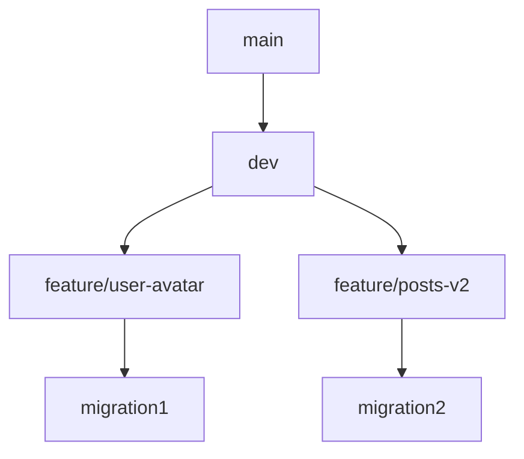

# Migration Strategy

## Prisma Migration Workflow

### Daily Development

```bash
# 1. Edit schema.prisma
# 2. Create migration
npx prisma migrate dev --name add-user-avatar

# 3. Apply to dev DB
npx prisma migrate dev

# 4. Generate client
npx prisma generate
```

### Migration Naming Convention

```bash
# Formato: {type}-{description}
npx prisma migrate dev --name add-user-avatar-field
npx prisma migrate dev --name create-posts-table
npx prisma migrate dev --name rename-description-to-body
npx prisma migrate dev --name remove-obsolete-columns
```

### File Structure

```
prisma/
├── schema.prisma           # Main schema
├── migrations/
│   ├── 20240101000000_add_user_avatar/
│   │   ├── migration.sql
│   │   └── migration_lock.json
│   └── migration.sql       # Squashed migration (optional)
└── seeds/
    └── seed.ts             # Seed data
```

## Safe Migration Patterns

### Add Column (Safe)

```sql
-- ✅ Safe: nullable or with default
ALTER TABLE "User" ADD COLUMN "avatarUrl" TEXT;
ALTER TABLE "Post" ADD COLUMN "viewCount" INTEGER NOT NULL DEFAULT 0;
```

### Add NOT NULL Column

```sql
-- ❌ Dangerous: fails if table has rows
ALTER TABLE "User" ADD COLUMN "tenantId" TEXT NOT NULL;

-- ✅ Safe: multi-step
-- Step 1: Add nullable
ALTER TABLE "User" ADD COLUMN "tenantId" TEXT;

-- Step 2: Backfill (in batches)
UPDATE "User" SET "tenantId" = 'default' WHERE "tenantId" IS NULL;

-- Step 3: Add NOT NULL constraint
ALTER TABLE "User" ALTER COLUMN "tenantId" SET NOT NULL;
```

### Rename Column

```sql
-- ❌ Dangerous: breaks existing queries
ALTER TABLE "Post" RENAME COLUMN "description" TO "body";

-- ✅ Safe: use additive approach
-- Step 1: Add new column
ALTER TABLE "Post" ADD COLUMN "body" TEXT;

-- Step 2: Dual-write (app writes to both)
-- Deploy app update

-- Step 3: Backfill old data
UPDATE "Post" SET "body" = "description" WHERE "body" IS NULL;

-- Step 4: Remove old column (deferred)
ALTER TABLE "Post" DROP COLUMN "description";
```

### Drop Column

```sql
-- ✅ Safe: ensure no app code references it
ALTER TABLE "User" DROP COLUMN "oldField";
```

## Zero-Downtime Migrations

### Expand-Contract Pattern

```
Step 1: EXPAND - Add new structure (table/column), dual-write reads
Step 2: MIGRATE - Backfill data
Step 3: CONTRACT - Remove old structure

Timeline:
  T1: Deploy v1 with dual-read/write
  T2: Backfill data (background job)
  T3: Deploy v2 using only new structure
  T4: Remove old columns/tables
```

```typescript
// EXPAND phase: read from new, fallback to old
async function getUser(id: string): Promise<User> {
  // Try new first
  const user = await prisma.user.findUnique({ where: { id } });
  if (user) return user;

  // Fallback to old (during migration)
  return legacyRepo.findById(id);
}
```

### Avoiding Locks

```sql
-- PostgreSQL: CREATE INDEX CONCURRENTLY avoids table lock
CREATE INDEX CONCURRENTLY IF NOT EXISTS "idx_post_author" ON "Post"("authorId");

-- Add FK without validation first
ALTER TABLE "Comment" ADD COLUMN "postId" TEXT;
ALTER TABLE "Comment" ADD CONSTRAINT "fk_comment_post"
  FOREIGN KEY ("postId") REFERENCES "Post"("id")
  NOT VALID; -- no lock

-- Validate later (short lock)
ALTER TABLE "Comment" VALIDATE CONSTRAINT "fk_comment_post";
```

## Branching Strategy



```
main          : baseline migrations (applied to prod)
dev           : merged migrations
feature/*     : feature-specific migrations

Rules:
- main migrations always applied to prod
- No squash on feature branches until merge
- After merge, dev gets all migrations applied
- Use `prisma migrate dev` on feature, `prisma migrate deploy` on prod
```

## Squashing Migrations

```bash
# When migrations become too many (>50), squash
# 1. Ensure all migrations are applied to all environments
# 2. Backup current schema
npx prisma migrate diff --from-empty --to-schema-datamodel prisma/schema.prisma \
  --script > prisma/migrations/0_squashed/migration.sql

# 3. Reset migration history
rm -rf prisma/migrations/
prisma migrate dev --name init

# 4. Verify
prisma migrate diff
```

### When to Squash

- After major release (>50 migrations)
- Before branching for a new major version
- When migration apply time exceeds 30s in CI
- At least once per quarter

## Testing Migrations

```typescript
// test/migrations/migration.spec.ts
import { execSync } from 'child_process';

describe('Migrations', () => {
  const testDbUrl = process.env.TEST_DATABASE_URL;

  beforeAll(() => {
    process.env.DATABASE_URL = testDbUrl;
  });

  it('should apply all migrations successfully', () => {
    // Apply all migrations to test DB
    const output = execSync('npx prisma migrate deploy', {
      env: { ...process.env, DATABASE_URL: testDbUrl },
    }).toString();

    expect(output).not.toContain('Error');
    expect(output).toContain('All migrations have been successfully applied');
  });

  it('should rollback gracefully', () => {
    // Test rollback of last migration
    const lastMigration = execSync(
      'npx prisma migrate diff --to-migration last',
    ).toString();

    // Verify the down migration is safe
    expect(lastMigration).not.toContain('DROP COLUMN');
  });

  it('seed data should be valid', async () => {
    // Run seeds and verify constraints
    await execSync('npx prisma db seed');
    const userCount = await prisma.user.count();
    expect(userCount).toBeGreaterThan(0);
  });
});
```

## CI/CD Pipeline

```yaml
# .github/workflows/deploy.yml
jobs:
  migrate:
    runs-on: ubuntu-latest
    steps:
      - uses: actions/checkout@v4

      - name: Run migrations in preview
        run: npx prisma migrate deploy
        env:
          DATABASE_URL: ${{ secrets.PREVIEW_DATABASE_URL }}

      - name: Verify migration
        run: npx prisma validate

      - name: Smoke test
        run: npx prisma db execute --stdin <<< "SELECT 1"

      - name: Apply migrations to production
        if: github.ref == 'refs/heads/main'
        run: npx prisma migrate deploy
        env:
          DATABASE_URL: ${{ secrets.PROD_DATABASE_URL }}
```

## Rollback Strategy

```typescript
// Rollback script (manual)
async function rollbackLastMigration() {
  // 1. Identify last migration
  const lastMigration = await prisma.$queryRaw`
    SELECT * FROM _prisma_migrations ORDER BY finished_at DESC LIMIT 1
  `;

  // 2. Generate rollback SQL
  const rollbackSql = await generateRollback(lastMigration.migration_name);

  // 3. Execute rollback
  await prisma.$executeRawUnsafe(rollbackSql);

  // 4. Delete migration record
  await prisma.$executeRawUnsafe`
    DELETE FROM _prisma_migrations WHERE migration_name = ${lastMigration.migration_name}
  `;
}
```

## Key Rules

1. **Squash migrations** cuando superen 50 archivos
2. **Zero-downtime** para cambios destructivos (rename, drop)
3. **Expand-Contract** para cambios breaking
4. **Test migrations** en CI con DB dedicada
5. **Nunca editar** migraciones ya aplicadas a producción
6. **Migraciones atómicas**: cada migration hace una cosa
7. **Rollback probado** antes del deploy
8. **Backfill batches** pequeños (~1000 registros) para no saturar DB
